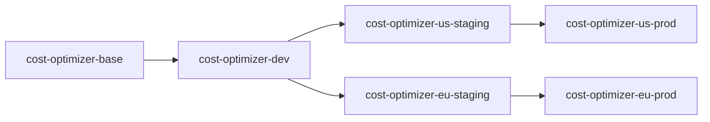
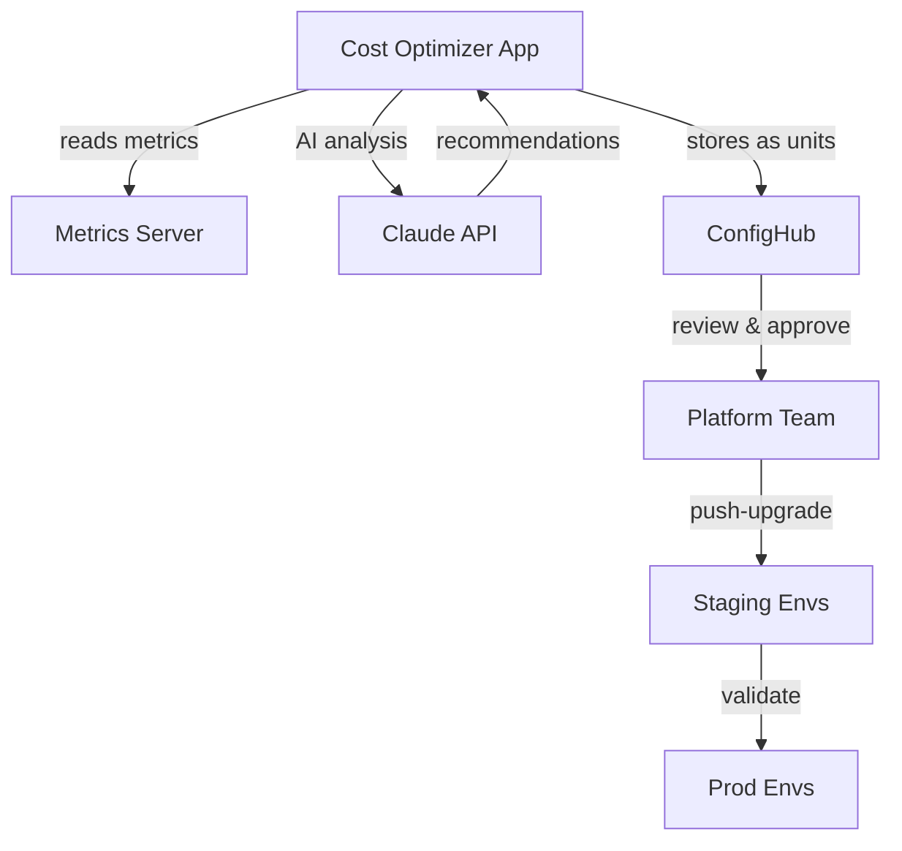

# Cost Optimizer Deployment

This example demonstrates how to use ConfigHub to deploy and manage a continuous cost optimization system that uses Claude AI to analyze and reduce Kubernetes spending across multiple environments.

First go through the [setup](#setup) steps to get things ready. Then move on to the scenario tasks:

- [Analyze costs and review recommendations](#analyze-costs-and-review-recommendations)
- [Apply cost optimizations](#apply-cost-optimizations)
- [Promote optimizations to staging](#promote-optimizations-to-staging)
- [Lateral promotion for region-specific optimization](#lateral-promotion-for-region-specific-optimization)
- [Roll back an optimization](#roll-back-an-optimization)
- [Use changesets for bulk optimization](#use-changesets-for-bulk-optimization)

## Scenario

The cost optimizer is a persistent Kubernetes application that:
- Monitors resource usage across all namespaces
- Uses Claude AI to generate intelligent cost-saving recommendations
- Calculates potential monthly savings for each recommendation
- Applies optimizations via ConfigHub units
- Tracks cost trends over time with historical analysis
- Provides a real-time web dashboard on port 8081

In this example, the cost optimizer is deployed in the following environments:

- Dev
- Staging
- Prod

where staging and prod can each be deployed in multiple regions (US, EU, Asia). This adds up to 7+ live environments with associated configs.

### ConfigHub Layout

The example is laid out with the cost optimizer app and monitored workloads. The optimizer uses ConfigHub to store recommended optimizations as units, which can be reviewed, tested in dev, and promoted through environments.

The app hierarchy uses spaces for each environment:



The following diagram shows the optimization flow:



### The purpose of base units

The `cost-optimizer-base` space contains the canonical configuration for the optimizer itself. Optimization recommendations are stored as separate units that can be tested in dev, promoted to staging for validation, and finally applied to prod using ConfigHub's push-upgrade feature.

## Setup

### Configure ConfigHub

First, set up units, spaces and filters in ConfigHub with:

    bin/install-base

This will:
- Create a unique project name (e.g., `fluffy-kitten`)
- Create spaces for base units, filters, and for each environment
- Create cost optimizer deployment units in the base space
- Create filters for high-cost resources and optimization candidates
- Create sets for grouping related optimizations

Next, set up all the individual environments:

    bin/install-envs

This defines the environment hierarchy and sets everything up accordingly in ConfigHub.

To check out what is in ConfigHub now, you can run:

    cub unit tree --node=space --filter $(bin/proj)/app --space '*'

which should print something like:

```
NODE                                 UNIT                    STATUS    UPGRADE-NEEDED    UNAPPLIED-CHANGES    APPLY-GATES
└── fluffy-kitten-base              cost-optimizer          NoLive                                           None
    └── fluffy-kitten-dev           cost-optimizer          NoLive    No                                     None
        ├── fluffy-kitten-us-staging cost-optimizer         NoLive    No                                     None
        │   └── fluffy-kitten-us-prod cost-optimizer        NoLive    No                                     None
        └── fluffy-kitten-eu-staging cost-optimizer         NoLive    No                                     None
            └── fluffy-kitten-eu-prod cost-optimizer        NoLive    No                                     None
```

### Deploy metrics-server

The cost optimizer requires metrics-server for resource usage data:

    kubectl apply -f https://github.com/kubernetes-sigs/metrics-server/releases/latest/download/components.yaml

Wait for metrics-server to be ready:

    kubectl get deployment metrics-server -n kube-system

### Optional: Deploy OpenCost

For more accurate cloud cost data, deploy OpenCost:

    bin/configure-opencost true
    bin/install-opencost-base
    bin/install-opencost-envs
    bin/apply-opencost dev

### Start a cluster

If you don't have a cluster yet:

    bin/create-cluster

### Deploy cost optimizer

Start with the dev environment:

    cub unit apply --space $(bin/proj)-dev

Once all units are ready, check the cost optimizer is running:

    kubectl get pods -n devops-apps

You should see:

```
NAME                              READY   STATUS    RESTARTS   AGE
cost-optimizer-7d9c8f5b6d-h4m9k   1/1     Running   0          45s
```

### Access the dashboard

Forward the dashboard port:

    kubectl port-forward -n devops-apps svc/cost-optimizer 8081:8081

Then open http://localhost:8081 to see the real-time cost analysis dashboard.

## Scenario Tasks

Now that we have everything set up, we can explore various cost optimization tasks.

### Analyze costs and review recommendations

The cost optimizer continuously analyzes resource usage and generates AI-powered recommendations.

#### Deploy test workloads

Create some workloads with optimization opportunities:

    bin/deploy-test-workloads

You should see:

```
🚀 Deploying test workloads
==========================
📦 Creating over-provisioned deployments...
deployment.apps/backend-api created (CPU: 1000m, Memory: 2Gi, Replicas: 5)
deployment.apps/frontend-web created (CPU: 500m, Memory: 1Gi, Replicas: 3)
deployment.apps/cache-redis created (CPU: 500m, Memory: 512Mi, Replicas: 2)

💰 Estimated monthly cost: $1,245.67
   Potential savings: $387.45 (31.1%)
```

#### View optimizer logs

Check what the cost optimizer detected:

    kubectl logs -n devops-apps -l app=cost-optimizer --tail=50

You should see:

```
[2025-10-01T14:20:15Z] INFO: Starting cost analysis cycle...
[2025-10-01T14:20:16Z] INFO: Analyzing 3 deployments across 1 namespace
[2025-10-01T14:20:17Z] INFO: 🤖 Claude AI: Identified 3 optimization opportunities
[2025-10-01T14:20:18Z] INFO:
  Recommendation 1: backend-api
    Type: Rightsize
    Current: CPU=1000m, Memory=2Gi, Replicas=5
    Suggested: CPU=400m, Memory=1Gi, Replicas=3
    Monthly savings: $187.25
    Risk: Low (usage < 40%)

[2025-10-01T14:20:19Z] INFO:
  Recommendation 2: frontend-web
    Type: Rightsize
    Current: CPU=500m, Memory=1Gi, Replicas=3
    Suggested: CPU=200m, Memory=512Mi, Replicas=2
    Monthly savings: $124.80
    Risk: Low (usage < 35%)

[2025-10-01T14:20:20Z] INFO: Total potential savings: $387.45/month (31.1%)
[2025-10-01T14:20:21Z] INFO: Storing recommendations in ConfigHub...
```

#### List optimization recommendations in ConfigHub

Check what recommendation units were created:

    cub unit list --space $(bin/proj)-dev --where "Labels.type='optimization'"

You should see:

```
NAME                      SPACE                  STATUS    DESCRIPTION
backend-api-opt           fluffy-kitten-dev      NoLive    Rightsize: Save $187.25/mo
frontend-web-opt          fluffy-kitten-dev      NoLive    Rightsize: Save $124.80/mo
cache-redis-opt           fluffy-kitten-dev      NoLive    Rightsize: Save $75.40/mo
```

#### View recommendation details

Get the full recommendation data:

    cub unit get-data backend-api-opt --space $(bin/proj)-dev

You should see:

```yaml
apiVersion: apps/v1
kind: Deployment
metadata:
  name: backend-api
  labels:
    optimization: rightsizing
    monthly-savings: "187.25"
    risk-level: low
spec:
  replicas: 3  # ← Reduced from 5
  template:
    spec:
      containers:
      - name: backend
        resources:
          requests:
            cpu: 400m      # ← Reduced from 1000m
            memory: 1Gi    # ← Reduced from 2Gi
          limits:
            cpu: 400m
            memory: 1Gi
```

#### View recommendations in the dashboard

Open http://localhost:8081 and you'll see:

```
┌─────────────────────────────────────────────────────────┐
│ Cost Optimizer Dashboard                                │
│                                                          │
│ Total Monthly Cost: $1,245.67                           │
│ Potential Savings:  $387.45 (31.1%)                     │
│                                                          │
│ Top Recommendations:                                    │
│ ┌──────────────────────────────────────────────────┐  │
│ │ 1. backend-api          Save $187.25/mo         │  │
│ │    Rightsize: 5→3 replicas, 1000m→400m CPU     │  │
│ │    Risk: Low    [Apply] [Details]               │  │
│ └──────────────────────────────────────────────────┘  │
│ ┌──────────────────────────────────────────────────┐  │
│ │ 2. frontend-web         Save $124.80/mo         │  │
│ │    Rightsize: 3→2 replicas, 500m→200m CPU      │  │
│ │    Risk: Low    [Apply] [Details]               │  │
│ └──────────────────────────────────────────────────┘  │
└─────────────────────────────────────────────────────────┘
```

### Apply cost optimizations

Once recommendations are reviewed, apply them to the dev environment.

#### Apply a single optimization

Test one optimization first:

    cub unit apply backend-api-opt --space $(bin/proj)-dev

Verify the deployment was updated:

    kubectl get deployment backend-api -n cost-test -o yaml | grep -A4 resources

You should see the reduced resource requests:

```yaml
resources:
  requests:
    cpu: 400m
    memory: 1Gi
```

#### Monitor the impact

Check if the application still performs well:

    kubectl top pods -n cost-test -l app=backend-api

You should see healthy resource usage:

```
NAME                          CPU(cores)   MEMORY(bytes)
backend-api-7d9c8f5b6d-abc12  250m         512Mi   # ← Well within limits
backend-api-7d9c8f5b6d-def34  230m         498Mi
backend-api-7d9c8f5b6d-ghi56  270m         534Mi
```

#### Apply all low-risk optimizations

Once confident, apply all remaining low-risk optimizations:

    cub unit apply --space $(bin/proj)-dev --where "Labels.risk-level='low'"

Check the new costs in the dashboard - you should see reduced spending.

### Promote optimizations to staging

After validating in dev for a few days, promote the optimizations to staging.

#### Check what needs promotion

See which optimizations are ready to promote:

    cub unit tree --node=space --filter $(bin/proj)/opt --space '*' --columns Space.Slug,UpgradeNeeded

You should see:

```
NODE                         UNIT              SPACE                        UPGRADE-NEEDED
└── fluffy-kitten-base       backend-api-opt   fluffy-kitten-base
    └── fluffy-kitten-dev    backend-api-opt   fluffy-kitten-dev            No
        ├── fluffy-kitten-us-staging backend-api-opt fluffy-kitten-us-staging Yes  # ← Needs update
        │   └── fluffy-kitten-us-prod backend-api-opt fluffy-kitten-us-prod    No
        └── fluffy-kitten-eu-staging backend-api-opt fluffy-kitten-eu-staging Yes  # ← Needs update
            └── fluffy-kitten-eu-prod backend-api-opt fluffy-kitten-eu-prod    No
```

#### Promote to both staging environments

Use push-upgrade to propagate optimizations:

    cub unit update --patch --upgrade --space $(bin/proj)-us-staging
    cub unit update --patch --upgrade --space $(bin/proj)-eu-staging

#### Apply staging changes

Deploy the optimized configurations:

    cub unit apply --space $(bin/proj)-us-staging
    cub unit apply --space $(bin/proj)-eu-staging

#### Validate cost savings

After 24 hours, check actual cost reduction:

    kubectl logs -n devops-apps -l app=cost-optimizer --tail=20

You should see cost tracking:

```
[2025-10-02T14:20:15Z] INFO: 24-hour cost analysis
[2025-10-02T14:20:16Z] INFO: Dev environment:
  Before optimization: $41.52/day
  After optimization:  $28.67/day
  Actual savings:      $12.85/day ($387.45/month) ✅

[2025-10-02T14:20:17Z] INFO: US-Staging environment:
  Before optimization: $38.90/day
  After optimization:  $26.34/day
  Actual savings:      $12.56/day ($378.60/month) ✅
```

### Lateral promotion for region-specific optimization

Sometimes one region has unique cost characteristics. Use lateral promotion to test region-specific optimizations.

#### Identify region-specific opportunity

Suppose EU has lower network costs. Create an EU-specific optimization:

    cub run set-env-var \
      --container-name backend \
      --env-var ENABLE_COMPRESSION \
      --env-value "true" \
      --space $(bin/proj)-eu-staging

Apply and test in EU staging:

    cub unit apply --space $(bin/proj)-eu-staging

#### Get revision history

Find the revision with the optimization:

    cub revision list backend-api-opt --space $(bin/proj)-eu-staging

You should see:

```
REVISION    TIMESTAMP              DESCRIPTION
5           2025-10-02T15:30:00Z   Enable compression for EU region
4           2025-10-02T14:20:00Z   Promoted from dev
3           2025-10-01T14:20:00Z   Initial optimization
```

#### Diff to see the change

    cub unit diff -u backend-api-opt --space $(bin/proj)-eu-staging --from=4 --to=5

You should see:

```diff
--- Revision 4: 2025-10-02T14:20:00Z
+++ Revision 5: 2025-10-02T15:30:00Z
@@ -12,6 +12,8 @@
       containers:
       - name: backend
         env:
+        - name: ENABLE_COMPRESSION
+          value: "true"
         resources:
           requests:
             cpu: 400m
```

#### Promote laterally to EU prod

Once validated in EU staging, promote directly to EU prod (bypassing US):

    cub unit update backend-api-opt \
      --space $(bin/proj)-eu-prod \
      --merge-unit $(bin/proj)-eu-staging/backend-api-opt \
      --merge-base=4 --merge-end=5

Apply to EU prod:

    cub unit apply --space $(bin/proj)-eu-prod

Note that US environments remain unchanged - this optimization is EU-specific.

### Roll back an optimization

If an optimization causes issues, use ConfigHub's revision history to roll back.

#### Identify the problem

Suppose the backend-api optimization caused performance issues:

    kubectl logs -n cost-test -l app=backend-api --tail=20

You see errors:

```
[2025-10-03T10:15:30Z] ERROR: OutOfMemoryError: Java heap space
[2025-10-03T10:15:31Z] ERROR: Request processing failed
```

#### Check revision history

Find the revision before the optimization:

    cub revision list backend-api-opt --space $(bin/proj)-dev

You should see:

```
REVISION    TIMESTAMP              DESCRIPTION
6           2025-10-01T14:20:21Z   Applied optimization (current)
5           2025-10-01T10:00:00Z   Previous stable config
4           2025-09-30T16:30:00Z   Initial deployment
```

#### Roll back to previous revision

Restore the previous configuration:

    cub unit apply backend-api-opt --space $(bin/proj)-dev --revision=5

Verify the deployment rolled back:

    kubectl get deployment backend-api -n cost-test -o yaml | grep replicas

You should see:

```yaml
spec:
  replicas: 5  # ← Restored from 3
```

#### Update the optimization unit

Mark the optimization as failed and update it:

    cub unit update backend-api-opt --space $(bin/proj)-dev \
      --patch '{"metadata": {"labels": {"status": "rolled-back", "reason": "oom-errors"}}}' \
      --change-desc "Rolled back due to OOM errors"

This prevents the optimization from being promoted to other environments.

### Use changesets for bulk optimization

When optimizing multiple related services, use changesets to apply changes atomically.

#### Create a changeset

Group frontend service optimizations:

    cub changeset create --space $(bin/proj) frontend-optimization \
      --description "Optimize all frontend services"

#### Lock units to changeset

Prevent conflicting changes:

    cub unit update --patch \
      --space $(bin/proj)-dev \
      --changeset $(bin/proj)/frontend-optimization \
      --where "Labels.tier='frontend' AND Labels.type='optimization'"

#### View locked units

Check which units are part of the changeset:

    cub unit list --space $(bin/proj)-dev --where "ChangesetID = '$(bin/proj)/frontend-optimization'"

You should see:

```
NAME                SPACE               CHANGESET                    STATUS
frontend-web-opt    fluffy-kitten-dev   frontend-optimization        Locked
frontend-api-opt    fluffy-kitten-dev   frontend-optimization        Locked
frontend-cache-opt  fluffy-kitten-dev   frontend-optimization        Locked
```

#### Apply optimizations under changeset

Update resources for all frontend services:

    cub run set-container-resources \
      --space $(bin/proj)-dev \
      --changeset $(bin/proj)/frontend-optimization \
      --memory 512Mi \
      --cpu 200m \
      --where "Labels.tier='frontend'"

#### Unlock and apply atomically

Release the changeset lock:

    cub unit update --patch --changeset - \
      --space $(bin/proj)-dev \
      --where "ChangesetID = '$(bin/proj)/frontend-optimization'"

Apply all changes together:

    cub unit apply \
      --space $(bin/proj)-dev \
      --revision "ChangeSet:$(bin/proj)/frontend-optimization"

#### Verify changeset application

Check the changeset was applied successfully:

    cub changeset get frontend-optimization --space $(bin/proj) --json | jq '.Status'

You should see:

```json
{
  "Applied": true,
  "UnitsAffected": 3,
  "TotalSavings": "$245.20/month",
  "Timestamp": "2025-10-03T16:45:00Z"
}
```

## Notes

### Claude AI Integration

The cost optimizer uses Claude to:
- Analyze resource usage patterns
- Calculate realistic savings estimates
- Assess risk levels for each optimization
- Prioritize recommendations by impact
- Provide natural language explanations

Set `CLAUDE_API_KEY` environment variable to enable AI features.

### OpenCost Integration

For accurate cloud billing data:
- Deploys OpenCost via ConfigHub (not kubectl)
- Auto-detects OpenCost availability
- Falls back to AWS pricing estimates if unavailable
- Configure with `bin/configure-opencost true`

### Dashboard Features

Access at http://localhost:8081:
- Real-time cost visualization
- One-click optimization application
- Historical cost trends
- ConfigHub unit browser
- Claude conversation history

### Optimization Categories

The cost optimizer detects:
- **Rightsizing**: Reduce over-provisioned resources
- **Replica reduction**: Scale down underutilized deployments
- **Spot instances**: Suggest spot-compatible workloads
- **Storage optimization**: Identify unused PVCs
- **Network optimization**: Reduce cross-AZ traffic

### Safety Features

- Risk assessment for each optimization
- Gradual rollout via environment hierarchy
- Automatic rollback on errors
- Validation period between environments
- Manual approval option for high-risk changes

### Troubleshooting

**Issue: No recommendations generated**

Check metrics-server is running:

    kubectl get pods -n kube-system -l k8s-app=metrics-server

**Issue: Costs not accurate**

Deploy OpenCost for real billing data:

    bin/apply-opencost dev

**Issue: Optimization not applied**

Check unit apply status:

    cub unit get-live-state backend-api-opt --space $(bin/proj)-dev

**Issue: Dashboard not accessible**

Verify port-forward:

    kubectl get svc cost-optimizer -n devops-apps
