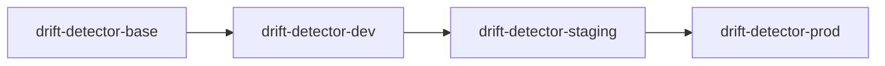
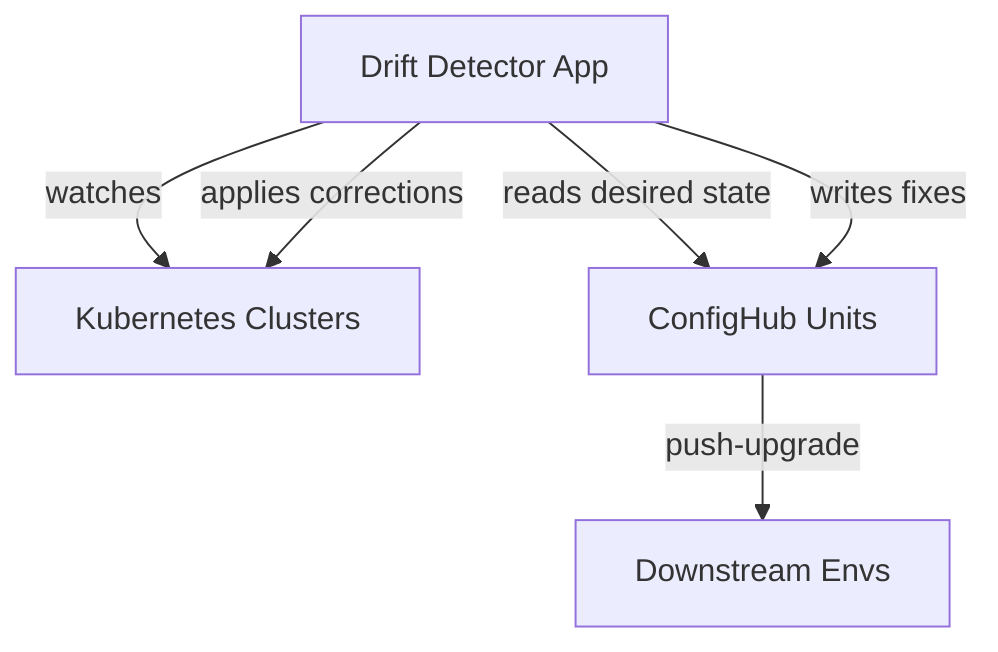

# Drift Detector Deployment

This example demonstrates how to use ConfigHub to deploy and manage a continuous drift detection system across multiple Kubernetes environments.

First go through the [setup](#setup) steps to get things ready. Then move on to the scenario tasks:

- [Detect and fix drift automatically](#detect-and-fix-drift-automatically)
- [View drift corrections in ConfigHub](#view-drift-corrections-in-confighub)
- [Promote drift fixes to other environments](#promote-drift-fixes-to-other-environments)
- [Introduce and monitor drift patterns](#introduce-and-monitor-drift-patterns)
- [Use changesets for bulk drift correction](#use-changesets-for-bulk-drift-correction)

## Scenario

The drift detector is a persistent Kubernetes application that:
- Monitors Deployments, StatefulSets, and DaemonSets for configuration drift
- Compares live cluster state against ConfigHub units (source of truth)
- Uses Claude AI to analyze drift patterns and recommend fixes
- Auto-corrects drift using ConfigHub's push-upgrade pattern
- Tracks all drift events in ConfigHub for audit trail

In this example, the drift detector is deployed in the following environments:

- Dev
- Staging
- Prod

where staging and prod can each be deployed in multiple regions. This adds up to 3+ live environments with associated configs.

### ConfigHub Layout

The example is laid out with an app part (drift detector itself) and monitored workloads. The drift detector maintains desired state in ConfigHub and continuously reconciles actual cluster state.

The app hierarchy uses spaces for each environment:



The following diagram shows the monitoring setup:



### The purpose of base units

The `drift-detector-base` space contains the canonical configuration. Changes made here can be promoted to dev → staging → prod using ConfigHub's push-upgrade feature. This allows testing drift detection rules in dev before rolling out to production.

## Setup

### Configure ConfigHub

First, set up units, spaces and filters in ConfigHub with:

    bin/install-base

This will:
- Create a unique project name which will be used as space prefix for this example
- Create spaces for base units, filters, and for each environment
- Create drift detector deployment units and load config into the base space
- Create filters for targeting critical services

Next, set up all the individual environments:

    bin/install-envs

This defines the environment hierarchy and sets everything up accordingly in ConfigHub. It's a good idea to read the source of this script and the scripts being called from there to understand what is going on.

To check out what is in ConfigHub now, you can run:

    cub unit tree --node=space --filter $(bin/proj)/app --space '*'

which should print something like:

```
NODE                                 UNIT                    STATUS    UPGRADE-NEEDED    UNAPPLIED-CHANGES    APPLY-GATES
└── chubby-paws-base                 drift-detector          NoLive                                           None
    └── chubby-paws-dev              drift-detector          NoLive    No                                     None
        └── chubby-paws-staging      drift-detector          NoLive    No                                     None
            └── chubby-paws-prod     drift-detector          NoLive    No                                     None
```

### Start a cluster

Start and configure a Kind cluster with:

    bin/create-cluster

After it completes, you will notice that all units except the base units now have a cluster target.

### Apply infrastructure

If you haven't already deployed metrics-server (required for resource metrics):

    kubectl apply -f https://github.com/kubernetes-sigs/metrics-server/releases/latest/download/components.yaml

### Deploy drift detector

Start with the dev environment:

    cub unit apply --space $(bin/proj)-dev

Once all units are ready, check the drift detector is running:

    kubectl get pods -n devops-apps

You should see:

```
NAME                              READY   STATUS    RESTARTS   AGE
drift-detector-6f8d7c9b5d-x7k2p   1/1     Running   0          30s
```

## Scenario Tasks

Now that we have everything set up, we can explore various drift detection tasks.

### Detect and fix drift automatically

This is probably the most common operational task. The drift detector runs continuously and auto-corrects any drift it detects.

#### Deploy test workloads with drift

Let's deploy some test workloads and intentionally introduce drift:

    bin/deploy-test --with-drift

You should see:

```
🚀 Deploying test workloads
==========================
📦 Deploying workloads to drift-test namespace...
deployment.apps/backend-api created
deployment.apps/frontend-web created

📊 Current State:
NAME           READY   UP-TO-DATE   AVAILABLE
backend-api    3/3     3            3
frontend-web   2/2     2            2

🔄 Introducing drift for testing...
deployment.apps/backend-api scaled
deployment.apps/frontend-web scaled

⚠️  Drift introduced! Deployments now differ from ConfigHub:
  - backend-api: 5 replicas (expected: 3)
  - frontend-web: 1 replica (expected: 2)
```

#### Watch drift detection in action

View the drift detector logs:

    kubectl logs -n devops-apps -l app=drift-detector --follow

You should see drift detection and auto-correction:

```
[2025-10-01T12:15:30Z] INFO: Resource updated, triggering drift detection...
[2025-10-01T12:15:31Z] WARN: ⚠️  DRIFT DETECTED: backend-api has 5 replicas, expected 3
[2025-10-01T12:15:31Z] WARN: ⚠️  DRIFT DETECTED: frontend-web has 1 replica, expected 2
[2025-10-01T12:15:32Z] INFO: 🤖 Claude AI analysis: Over-scaling detected, cost impact $240/month
[2025-10-01T12:15:33Z] INFO: 🔧 Applying fixes using ConfigHub...
[2025-10-01T12:15:34Z] INFO: ✅ Fixed: backend-api scaled to 3 replicas
[2025-10-01T12:15:35Z] INFO: ✅ Fixed: frontend-web scaled to 2 replicas
```

#### Verify drift was corrected

Check that deployments are back to desired state:

    kubectl get deployments -n drift-test

You should see:

```
NAME           READY   UP-TO-DATE   AVAILABLE   AGE
backend-api    3/3     3            3           2m   # ✅ Fixed from 5 to 3
frontend-web   2/2     2            2           2m   # ✅ Fixed from 1 to 2
```

### View drift corrections in ConfigHub

After drift is detected and fixed, ConfigHub stores the correction as a new unit revision.

#### List drift correction units

Check what units were created or updated:

    cub unit list --space $(bin/proj)-dev

You should see units for the drift detector and any monitored workloads:

```
NAME                    SPACE               STATUS    LAST-ACTION
drift-detector          chubby-paws-dev     Applied   2025-10-01T12:10:00Z
backend-api-config      chubby-paws-dev     Applied   2025-10-01T12:15:34Z
frontend-web-config     chubby-paws-dev     Applied   2025-10-01T12:15:35Z
```

#### View revision history

See the history of changes for a specific workload:

    cub revision list backend-api-config --space $(bin/proj)-dev

You should see:

```
REVISION    TIMESTAMP              AUTHOR            DESCRIPTION
3           2025-10-01T12:15:34Z   drift-detector    Fixed replicas: 5 → 3
2           2025-10-01T12:10:15Z   drift-detector    Scaled to 5 (drift detected)
1           2025-10-01T12:00:00Z   admin             Initial deployment
```

#### Diff between revisions

See what changed when drift was fixed:

    cub unit diff -u backend-api-config --space $(bin/proj)-dev --from=2 --to=3

You should see:

```diff
--- Revision 2: 2025-10-01T12:10:15Z
+++ Revision 3: 2025-10-01T12:15:34Z
@@ -8,7 +8,7 @@
 metadata:
   name: backend-api
 spec:
-  replicas: 5
+  replicas: 3
   selector:
     matchLabels:
       app: backend-api
```

### Promote drift fixes to other environments

Once drift fixes are validated in dev, you can promote them to staging and prod using ConfigHub's push-upgrade pattern.

#### Check upgrade status

See which environments need the drift fix:

    cub unit tree --node=space --filter $(bin/proj)/app --space '*' --columns Space.Slug,UpgradeNeeded

You should see:

```
NODE                        UNIT                    SPACE                   UPGRADE-NEEDED
└── chubby-paws-base        backend-api-config      chubby-paws-base
    └── chubby-paws-dev     backend-api-config      chubby-paws-dev         No
        └── chubby-paws-staging backend-api-config   chubby-paws-staging     Yes  # ← Needs update
            └── chubby-paws-prod backend-api-config  chubby-paws-prod        No
```

#### Promote to staging

Use push-upgrade to propagate the fix:

    cub unit update --patch --upgrade --space $(bin/proj)-staging

This merges the drift fix from dev to staging while preserving any staging-specific customizations.

#### Apply staging changes

Deploy the updated configuration:

    cub unit apply --space $(bin/proj)-staging

Verify staging deployments have the correct replica counts:

    kubectl get deployments -n drift-test-staging

#### Continue to prod

Once validated in staging, promote to prod:

    cub unit update --patch --upgrade --space $(bin/proj)-prod
    cub unit apply --space $(bin/proj)-prod

### Introduce and monitor drift patterns

The drift detector tracks patterns over time using ConfigHub Sets.

#### Create a set for critical services

Group services that require strict drift monitoring:

    cub set create critical-services --space $(bin/proj)-dev \
      --label tier=critical

#### Add units to the set

Update units to be part of the critical set (this would typically be done during unit creation):

    cub unit update backend-api-config --space $(bin/proj)-dev \
      --patch '{"SetID": "<set-id-from-above>"}'

#### Introduce drift to critical service

Scale a critical service:

    kubectl scale deployment backend-api -n drift-test --replicas=10

Watch the drift detector respond more urgently to critical service drift:

    kubectl logs -n devops-apps -l app=drift-detector --tail=20

You should see:

```
[2025-10-01T12:30:15Z] WARN: ⚠️  CRITICAL DRIFT: backend-api (tier=critical) has 10 replicas, expected 3
[2025-10-01T12:30:16Z] INFO: 🤖 Claude AI: Critical service over-scaled by 233%, immediate correction required
[2025-10-01T12:30:16Z] INFO: 🚨 High-priority fix: backend-api
[2025-10-01T12:30:17Z] INFO: ✅ CRITICAL FIX APPLIED: backend-api scaled to 3 replicas
```

#### View drift patterns

List all units in the critical set:

    cub unit list --space $(bin/proj)-dev --where "SetID = '<set-id>'"

### Use changesets for bulk drift correction

When multiple services drift together (e.g., during an incident), use changesets to correct them atomically.

#### Create a changeset

Group multiple drift corrections:

    cub changeset create --space $(bin/proj) bulk-drift-fix \
      --description "Fix drift across all frontend services"

#### Lock units to changeset

Prevent other changes while fixing drift:

    cub unit update --patch \
      --space $(bin/proj)-dev \
      --changeset $(bin/proj)/bulk-drift-fix \
      --where "Labels.tier='frontend'"

#### Apply fixes under changeset

All fixes now belong to this changeset:

```bash
# The drift detector automatically uses the active changeset
# Watch as it applies fixes
kubectl logs -n devops-apps -l app=drift-detector --follow
```

You should see:

```
[2025-10-01T12:45:10Z] INFO: Using changeset bulk-drift-fix for corrections
[2025-10-01T12:45:11Z] INFO: ✅ Fixed frontend-web (changeset: bulk-drift-fix)
[2025-10-01T12:45:12Z] INFO: ✅ Fixed frontend-api (changeset: bulk-drift-fix)
[2025-10-01T12:45:13Z] INFO: ✅ Fixed frontend-cache (changeset: bulk-drift-fix)
```

#### Apply changeset atomically

Once all fixes are ready, apply the entire changeset:

    cub unit apply \
      --space $(bin/proj)-dev \
      --where "Labels.tier='frontend'" \
      --revision "ChangeSet:$(bin/proj)/bulk-drift-fix"

#### View changeset results

Check what was corrected:

    cub changeset get bulk-drift-fix --space $(bin/proj) --json | jq '.Units'

You should see all units that were fixed as part of this changeset.

## Notes

### Claude AI Integration

The drift detector uses Claude to:
- Analyze drift patterns and severity
- Calculate cost impact of drift
- Recommend prioritization for fixes
- Suggest root cause analysis

Set `CLAUDE_API_KEY` environment variable to enable AI features.

### Monitoring Dashboard

Access the real-time dashboard:

    kubectl port-forward -n devops-apps svc/drift-detector 8080:8080

Then open http://localhost:8080 to see:
- Live drift status
- AI recommendations
- ConfigHub unit browser
- Correction history

### Resource Requirements

The drift detector requires:
- Kubernetes 1.19+
- metrics-server for resource metrics
- RBAC permissions to read Deployments, StatefulSets, DaemonSets
- Optional: Claude API key for AI features

### Troubleshooting

**Issue: Drift detector not detecting drift**

Check if the workload is in a monitored namespace:

    kubectl get ns drift-test -o yaml | grep monitored

**Issue: Auto-correction not working**

Verify `AUTO_FIX` is enabled:

    kubectl get deployment drift-detector -n devops-apps -o yaml | grep AUTO_FIX

**Issue: ConfigHub connection failing**

Check the CUB_TOKEN secret:

    kubectl get secret drift-detector-secrets -n devops-apps -o yaml
